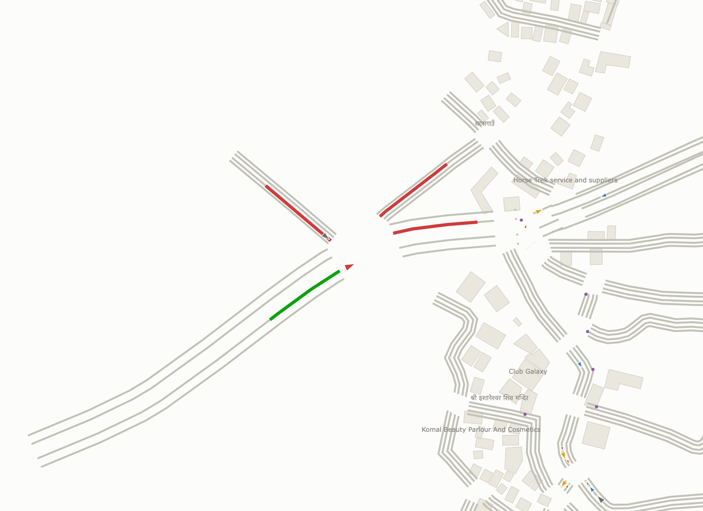
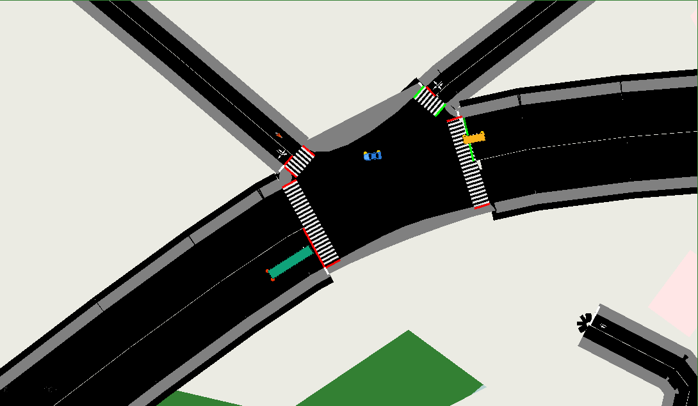

# Smart Traffic Management System — Kathmandu

An adaptive, AI-driven traffic signal control system simulated on a real
Kathmandu intersection (default: **Kalanki**), with an operator dashboard.

**Headline result:** on identical peak demand at the real 8-phase Kalanki
junction (sublane motorbike weaving on), adaptive+ML control cuts average
junction wait by **97.2% ± 0.7 (range 96.3–98.1% across 5 random seeds)** —
mean wait 354 → 10 s/cycle at unchanged throughput — vs a classic fixed
timer, which wastes green time on empty turn phases.


*Dashboard live map during an ambulance dispatch: the corridor approach is
green, every other approach red, the ambulance (large red arrow) inbound.
Buildings and place names are real OSM data.*


*sumo-gui opens centered on the junction with readable signal stop bars.*

## Realistic by construction

- **Real roads & buildings** — geometry, building footprints, and named
  places (the actual temple, shops, and clubs around Kalanki) all come from
  OpenStreetMap.
- **Real traffic mix** — 45% motorbikes, 30% cars, plus microbuses, buses,
  and trucks, with true sizes and driving profiles (Kathmandu valley shares).
- **Pedestrians** — 1800 people walking on guessed sidewalks and zebra
  crossings, signal-controlled at the junction.
- **Motorbike weaving** — SUMO's sublane model (0.4 m lateral resolution):
  bikes filter between queued cars to the stop line, like real Kalanki.
- **Rush-hour rhythm** — a "Full day" scenario compresses dawn → school
  rush → office peak → lull → evening into 30 minutes; watch junction
  pressure rise ~1000× at peak while adaptive control keeps it flowing.
- **Live tracking** — follow any vehicle on the dashboard map: type, speed,
  accumulated wait, current street.

Docs: `docs/architecture.md` (diagrams), `docs/DEMO_SCRIPT.md` (5-min demo),
`docs/VIVA_QA.md` (examiner Q&A), `docs/BUILD_LOG.md` (verified build history).

## Run it in 5 commands

```bash
python3 -m venv .venv && source .venv/bin/activate
pip install -r requirements.txt          # includes SUMO itself (eclipse-sumo)
python setup/build_network.py            # real Kalanki roads from OSM
python -m src.ml.generate_data && python -m src.ml.train_model
streamlit run dashboard/app.py           # the operator dashboard
```

`eclipse-sumo` ships the full SUMO binaries via pip — no system install or
SUMO_HOME needed (the code auto-detects it). A system SUMO from
`setup/install_sumo.md` works too.

## Detailed setup

### 1. Install SUMO

Easiest: `pip install eclipse-sumo` (bundled binaries, auto-detected).
Alternatively install system SUMO per `setup/install_sumo.md` and set
`SUMO_HOME`.

### 2. Python environment

```bash
python -m venv .venv
source .venv/bin/activate      # Windows: .venv\Scripts\activate
pip install -r requirements.txt
```

### 3. Build the Kathmandu network (one-time)

```bash
python setup/build_network.py
```

This downloads real OSM road geometry for the Kalanki junction, converts it
with `netconvert` (with sidewalks + zebra crossings), generates mixed-type
peak/off-peak vehicle demand and pedestrians with `randomTrips.py`, extracts
the real building footprints and POIs with `polyconvert`, and writes
`network/kathmandu.sumocfg`. To target a different real intersection, pass
`--lat --lon --name`, or edit the defaults in `src/config.py`.

Verify it worked:

```bash
sumo-gui -c network/kathmandu.sumocfg
```

You should see real Kathmandu road geometry with vehicles moving.

## Running (once later phases are built)

```bash
# headless automatic control
python -m src.controller --mode auto

# with SUMO GUI
python -m src.controller --mode auto --gui

# ML pipeline
python -m src.ml.generate_data
python -m src.ml.train_model

# dashboard
streamlit run dashboard/app.py

# tests
pytest -q
```

## Scope note

Road **geometry** is real (pulled from OpenStreetMap). Traffic **demand** is
simulated, calibrated to realistic peak/off-peak patterns — there is no live
camera/satellite feed. `src/sumo_env.py` documents the exact injection point
where a real sensor feed would plug in for a production deployment.
