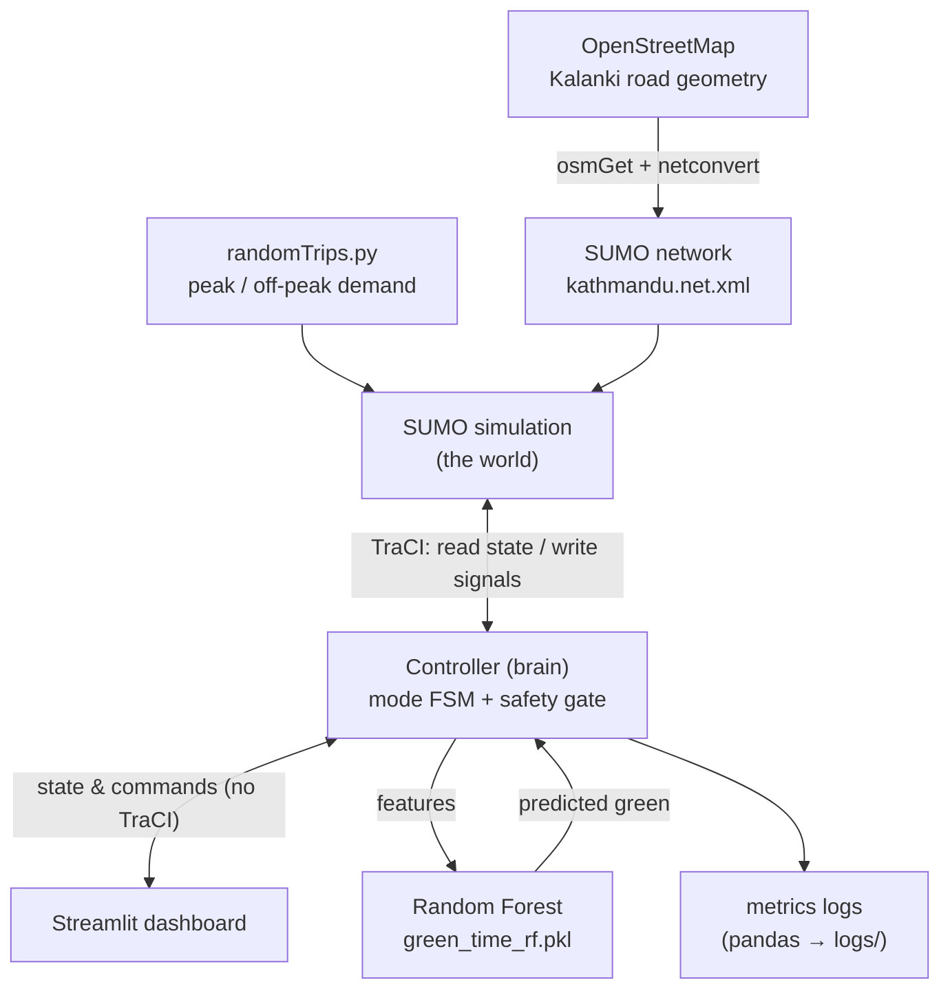
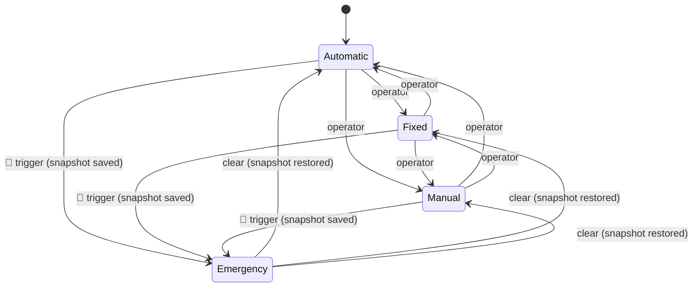
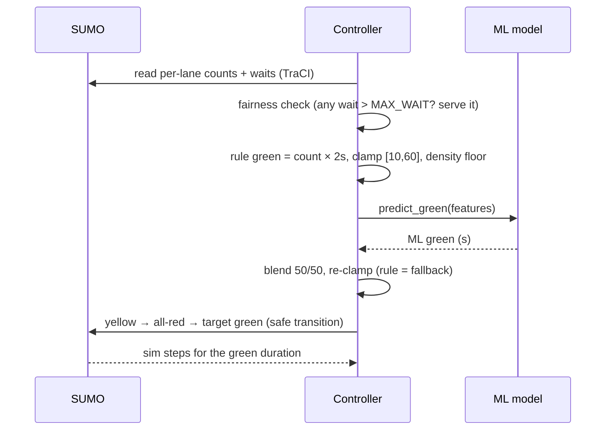

# Architecture

## System overview

The **golden rule**: the controller is the only component that talks to SUMO
via TraCI. The dashboard and the ML model interact only with the controller's
interface, so mode priority, safety, and state live in exactly one place.

## Mode priority (finite-state machine)

Priority order **Emergency > Manual > Fixed > Automatic**. Emergency snapshots
the running mode and the exact TLS state string on trigger, and restores both
on clear. On any decision error the controller fails safe to Fixed.

## Signal safety

Every change of right-of-way runs the sequence
**green → yellow (3 s) → all-red (2 s) → next green**, built by
`safety.safe_transition()`. `safety.is_safe_switch()` rejects any jump where
one link gains green while another drops it; the test suite audits every
state the controller applies.

## One control cycle (Automatic mode)

## Module map

| Module | Responsibility |
|---|---|
| `src/config.py` | every tunable number (timings, thresholds, paths, junction coords) |
| `src/sumo_env.py` | all TraCI I/O; documented sensor injection point |
| `src/safety.py` | transition sequences + unsafe-switch guard |
| `src/controller.py` | mode FSM, junction discovery, main loop, fail-safe |
| `src/modes/*.py` | one decision policy per mode (pure, unit-testable) |
| `src/ml/*.py` | data generation → RF training → runtime prediction |
| `src/metrics.py` | KPI computation + fixed-vs-adaptive experiment |
| `dashboard/app.py` | operator UI; talks to the controller only |

## Real vs simulated (scope honesty)

Road **geometry** is real OSM data of Kalanki, Kathmandu. Traffic **demand**
is simulated with calibrated peak/off-peak profiles. A real camera/satellite
feed would replace the bodies of `get_lane_vehicle_count()` /
`get_lane_waiting_time()` in `src/sumo_env.py` without touching any other
module — the system is sensor-ready by design.
